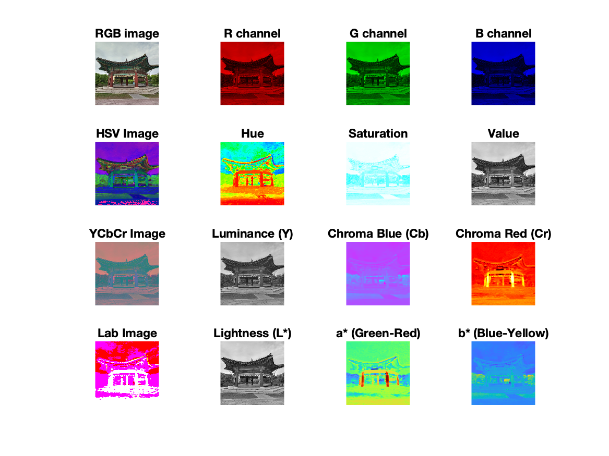

# 🎨🔬 Color Space Exploration with MATLAB 

Explore the fascinating world of color spaces using MATLAB! This repository contains a MATLAB script that demonstrates the conversion of an image through various color spaces including RGB, HSV, YCbCr, and Lab. Dive into the components of each color space and see how images are represented differently.

## 🚀 Features 

- **RGB Color Space Analysis** 🟥🟩🟦: Dissect an image into its Red, Green, and Blue components to understand how colors are combined in the digital world.
- **HSV Transformation** 🌈: Convert the RGB image to HSV (Hue, Saturation, Value) and explore how colors can be represented in terms of their chromaticity and luminance.
- **YCbCr Conversion** 📺: Delve into the YCbCr color space, used extensively in video compression, to analyze the luminance and chrominance components of the image.
- **Lab Color Space** 🧪: Experience the Lab color space, which is designed to approximate human vision, focusing on perceptual uniformity.

🏁 ## Getting Started 

Click to expand!

1. Clone this repository to your local machine.
2. Ensure you have MATLAB installed.
3. Open the script in MATLAB and run it.
4. The script will load a test image (ensure `test.jpg` is in your working directory), perform transformations, and display the results.

## 📊 Visual Guide 

Below is a visual representation of the different color spaces and their components as processed by the script. This image, named `color_spaces.png`, is a comprehensive guide to understanding how each color space represents colors and their components.

## 📝 Code Overview 

Click to expand!

The script performs the following operations:

- Loads and resizes an image to a standard dimension.
- Separates and displays the RGB components.
- Converts and displays the image in HSV, YCbCr, and Lab color spaces.
- Visualizes individual components of each color space.

## 🤝 Contributing 

Contributions are welcome! Feel free to fork this repository, make changes, and submit pull requests. If you find any bugs or have suggestions, please open an issue.

## 📜 License 

This project is licensed under the MIT License - see the LICENSE file for details.

